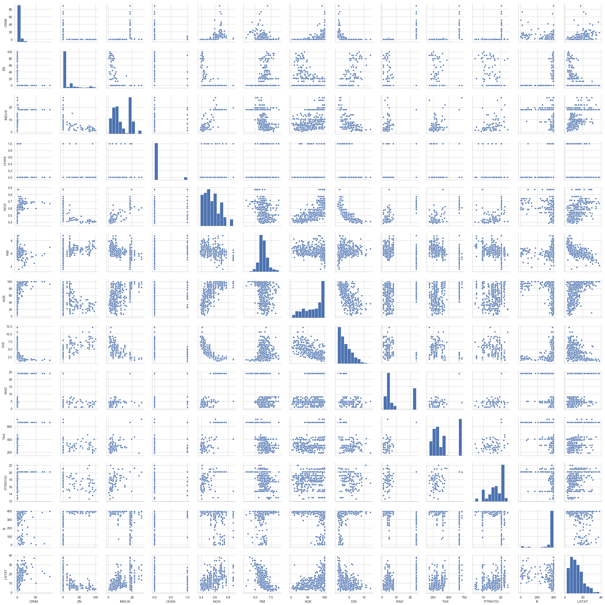
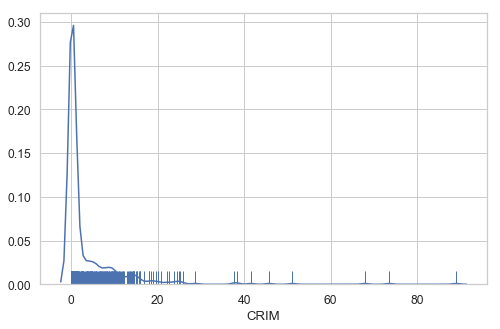
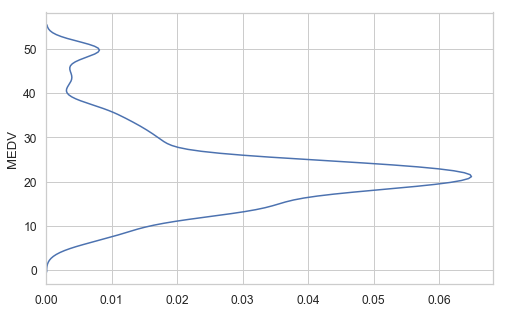
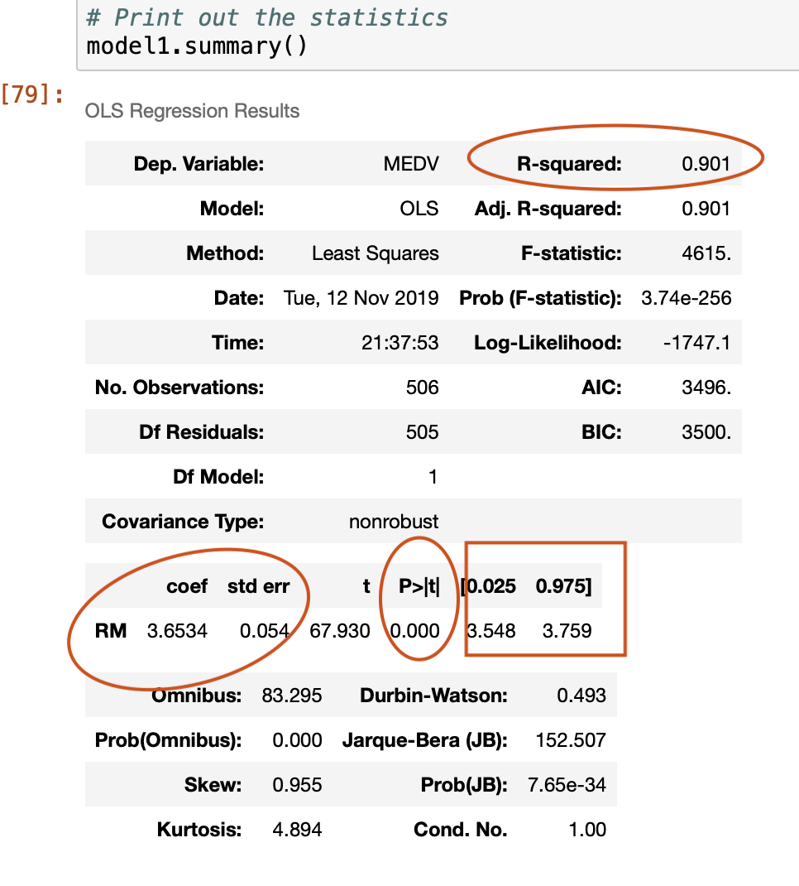
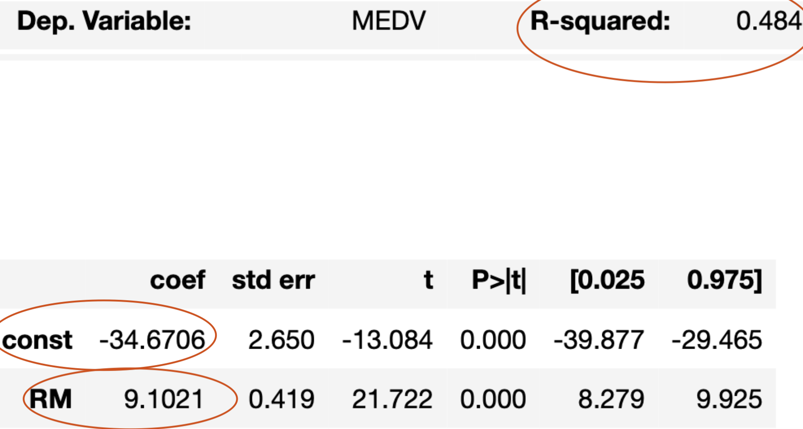

# Lab1:
$$\Huge \text{Linear Regression }$$

## Introduction :
    In this Lab  you'll predict the price, labeled as Median value of owner-occupied homes, of houses in Boston using  a predefined dataSet. 
    
    Objective :
        - plot different aspect of Dataset features
        - Create different linear & Multiple Regression Models
        - Analyse Models
        - Create a House Price Prediction 
    

####  Statsmodels
- Statsmodels is a Python module that provides classes and functions for the estimation of many different statistical models, as well as for conducting statistical tests, and statistical data exploration


```python
!pip install statsmodels
```

    Requirement already satisfied: statsmodels in /Users/anaconda3/lib/python3.7/site-packages (0.9.0)
    WARNING: You are using pip version 19.2.3, however version 19.3.1 is available.
    You should consider upgrading via the 'pip install --upgrade pip' command.


```python
import statsmodels.api as sm
```

#### sklearn
- free software machine learning library for the Python programming language.[3] It features various classification, regression and clustering algorithms


```python
from sklearn import datasets ## imports datasets from scikit-learn
data = datasets.load_boston() ## loads Boston dataset from datasets library 
```


```python
print(data.keys())
```

    dict_keys(['data', 'target', 'feature_names', 'DESCR', 'filename'])


```python
# numpy adds support for large, multi-dimensional arrays and matrices,
import numpy as np
import pandas as pd
# define the data/predictors as the pre-set feature names  
df = pd.DataFrame(data.data, columns=data.feature_names)

# A DataFrame for the Target
target = pd.DataFrame(data.target, columns=["MEDV"])
```


```python
df.info()
```

    <class 'pandas.core.frame.DataFrame'>
    RangeIndex: 506 entries, 0 to 505
    Data columns (total 13 columns):
    CRIM       506 non-null float64
    ZN         506 non-null float64
    INDUS      506 non-null float64
    CHAS       506 non-null float64
    NOX        506 non-null float64
    RM         506 non-null float64
    AGE        506 non-null float64
    DIS        506 non-null float64
    RAD        506 non-null float64
    TAX        506 non-null float64
    PTRATIO    506 non-null float64
    B          506 non-null float64
    LSTAT      506 non-null float64
    dtypes: float64(13)
    memory usage: 51.5 KB


```python
# get a glimse of the dataframe
df.head()
```


<div>
<style scoped>
    .dataframe tbody tr th:only-of-type {
        vertical-align: middle;
    }

    .dataframe tbody tr th {
        vertical-align: top;
    }

    .dataframe thead th {
        text-align: right;
    }
</style>
<table border="1" class="dataframe">
  <thead>
    <tr style="text-align: right;">
      <th></th>
      <th>CRIM</th>
      <th>ZN</th>
      <th>INDUS</th>
      <th>CHAS</th>
      <th>NOX</th>
      <th>RM</th>
      <th>AGE</th>
      <th>DIS</th>
      <th>RAD</th>
      <th>TAX</th>
      <th>PTRATIO</th>
      <th>B</th>
      <th>LSTAT</th>
    </tr>
  </thead>
  <tbody>
    <tr>
      <th>0</th>
      <td>0.00632</td>
      <td>18.0</td>
      <td>2.31</td>
      <td>0.0</td>
      <td>0.538</td>
      <td>6.575</td>
      <td>65.2</td>
      <td>4.0900</td>
      <td>1.0</td>
      <td>296.0</td>
      <td>15.3</td>
      <td>396.90</td>
      <td>4.98</td>
    </tr>
    <tr>
      <th>1</th>
      <td>0.02731</td>
      <td>0.0</td>
      <td>7.07</td>
      <td>0.0</td>
      <td>0.469</td>
      <td>6.421</td>
      <td>78.9</td>
      <td>4.9671</td>
      <td>2.0</td>
      <td>242.0</td>
      <td>17.8</td>
      <td>396.90</td>
      <td>9.14</td>
    </tr>
    <tr>
      <th>2</th>
      <td>0.02729</td>
      <td>0.0</td>
      <td>7.07</td>
      <td>0.0</td>
      <td>0.469</td>
      <td>7.185</td>
      <td>61.1</td>
      <td>4.9671</td>
      <td>2.0</td>
      <td>242.0</td>
      <td>17.8</td>
      <td>392.83</td>
      <td>4.03</td>
    </tr>
    <tr>
      <th>3</th>
      <td>0.03237</td>
      <td>0.0</td>
      <td>2.18</td>
      <td>0.0</td>
      <td>0.458</td>
      <td>6.998</td>
      <td>45.8</td>
      <td>6.0622</td>
      <td>3.0</td>
      <td>222.0</td>
      <td>18.7</td>
      <td>394.63</td>
      <td>2.94</td>
    </tr>
    <tr>
      <th>4</th>
      <td>0.06905</td>
      <td>0.0</td>
      <td>2.18</td>
      <td>0.0</td>
      <td>0.458</td>
      <td>7.147</td>
      <td>54.2</td>
      <td>6.0622</td>
      <td>3.0</td>
      <td>222.0</td>
      <td>18.7</td>
      <td>396.90</td>
      <td>5.33</td>
    </tr>
  </tbody>
</table>
</div>


```python
# Disaplay main dataframe features stats
df.describe()
```


<div>
<style scoped>
    .dataframe tbody tr th:only-of-type {
        vertical-align: middle;
    }

    .dataframe tbody tr th {
        vertical-align: top;
    }

    .dataframe thead th {
        text-align: right;
    }
</style>
<table border="1" class="dataframe">
  <thead>
    <tr style="text-align: right;">
      <th></th>
      <th>CRIM</th>
      <th>ZN</th>
      <th>INDUS</th>
      <th>CHAS</th>
      <th>NOX</th>
      <th>RM</th>
      <th>AGE</th>
      <th>DIS</th>
      <th>RAD</th>
      <th>TAX</th>
      <th>PTRATIO</th>
      <th>B</th>
      <th>LSTAT</th>
    </tr>
  </thead>
  <tbody>
    <tr>
      <th>count</th>
      <td>506.000000</td>
      <td>506.000000</td>
      <td>506.000000</td>
      <td>506.000000</td>
      <td>506.000000</td>
      <td>506.000000</td>
      <td>506.000000</td>
      <td>506.000000</td>
      <td>506.000000</td>
      <td>506.000000</td>
      <td>506.000000</td>
      <td>506.000000</td>
      <td>506.000000</td>
    </tr>
    <tr>
      <th>mean</th>
      <td>3.613524</td>
      <td>11.363636</td>
      <td>11.136779</td>
      <td>0.069170</td>
      <td>0.554695</td>
      <td>6.284634</td>
      <td>68.574901</td>
      <td>3.795043</td>
      <td>9.549407</td>
      <td>408.237154</td>
      <td>18.455534</td>
      <td>356.674032</td>
      <td>12.653063</td>
    </tr>
    <tr>
      <th>std</th>
      <td>8.601545</td>
      <td>23.322453</td>
      <td>6.860353</td>
      <td>0.253994</td>
      <td>0.115878</td>
      <td>0.702617</td>
      <td>28.148861</td>
      <td>2.105710</td>
      <td>8.707259</td>
      <td>168.537116</td>
      <td>2.164946</td>
      <td>91.294864</td>
      <td>7.141062</td>
    </tr>
    <tr>
      <th>min</th>
      <td>0.006320</td>
      <td>0.000000</td>
      <td>0.460000</td>
      <td>0.000000</td>
      <td>0.385000</td>
      <td>3.561000</td>
      <td>2.900000</td>
      <td>1.129600</td>
      <td>1.000000</td>
      <td>187.000000</td>
      <td>12.600000</td>
      <td>0.320000</td>
      <td>1.730000</td>
    </tr>
    <tr>
      <th>25%</th>
      <td>0.082045</td>
      <td>0.000000</td>
      <td>5.190000</td>
      <td>0.000000</td>
      <td>0.449000</td>
      <td>5.885500</td>
      <td>45.025000</td>
      <td>2.100175</td>
      <td>4.000000</td>
      <td>279.000000</td>
      <td>17.400000</td>
      <td>375.377500</td>
      <td>6.950000</td>
    </tr>
    <tr>
      <th>50%</th>
      <td>0.256510</td>
      <td>0.000000</td>
      <td>9.690000</td>
      <td>0.000000</td>
      <td>0.538000</td>
      <td>6.208500</td>
      <td>77.500000</td>
      <td>3.207450</td>
      <td>5.000000</td>
      <td>330.000000</td>
      <td>19.050000</td>
      <td>391.440000</td>
      <td>11.360000</td>
    </tr>
    <tr>
      <th>75%</th>
      <td>3.677083</td>
      <td>12.500000</td>
      <td>18.100000</td>
      <td>0.000000</td>
      <td>0.624000</td>
      <td>6.623500</td>
      <td>94.075000</td>
      <td>5.188425</td>
      <td>24.000000</td>
      <td>666.000000</td>
      <td>20.200000</td>
      <td>396.225000</td>
      <td>16.955000</td>
    </tr>
    <tr>
      <th>max</th>
      <td>88.976200</td>
      <td>100.000000</td>
      <td>27.740000</td>
      <td>1.000000</td>
      <td>0.871000</td>
      <td>8.780000</td>
      <td>100.000000</td>
      <td>12.126500</td>
      <td>24.000000</td>
      <td>711.000000</td>
      <td>22.000000</td>
      <td>396.900000</td>
      <td>37.970000</td>
    </tr>
  </tbody>
</table>
</div>


```python
# the target is a dataframe too adn it's related to the Median House Price. MEDV
target.describe()
```


<div>
<style scoped>
    .dataframe tbody tr th:only-of-type {
        vertical-align: middle;
    }

    .dataframe tbody tr th {
        vertical-align: top;
    }

    .dataframe thead th {
        text-align: right;
    }
</style>
<table border="1" class="dataframe">
  <thead>
    <tr style="text-align: right;">
      <th></th>
      <th>MEDV</th>
    </tr>
  </thead>
  <tbody>
    <tr>
      <th>count</th>
      <td>506.000000</td>
    </tr>
    <tr>
      <th>mean</th>
      <td>22.532806</td>
    </tr>
    <tr>
      <th>std</th>
      <td>9.197104</td>
    </tr>
    <tr>
      <th>min</th>
      <td>5.000000</td>
    </tr>
    <tr>
      <th>25%</th>
      <td>17.025000</td>
    </tr>
    <tr>
      <th>50%</th>
      <td>21.200000</td>
    </tr>
    <tr>
      <th>75%</th>
      <td>25.000000</td>
    </tr>
    <tr>
      <th>max</th>
      <td>50.000000</td>
    </tr>
  </tbody>
</table>
</div>


#### Seaborn 
- Seabornis a Python data visualization library based on matplotlib. It provides a high-level interface for drawing attractive and informative statistical graphics.


```python
!pip install seaborn
```

    Requirement already satisfied: seaborn in /Users/anaconda3/lib/python3.7/site-packages (0.9.0)
    Requirement already satisfied: pandas>=0.15.2 in /Users/anaconda3/lib/python3.7/site-packages (from seaborn) (0.23.4)
    Requirement already satisfied: matplotlib>=1.4.3 in /Users/anaconda3/lib/python3.7/site-packages (from seaborn) (3.0.2)
    Requirement already satisfied: scipy>=0.14.0 in /Users/anaconda3/lib/python3.7/site-packages (from seaborn) (1.1.0)
    Requirement already satisfied: numpy>=1.9.3 in /Users/anaconda3/lib/python3.7/site-packages (from seaborn) (1.15.4)
    Requirement already satisfied: python-dateutil>=2.5.0 in /Users/anaconda3/lib/python3.7/site-packages (from pandas>=0.15.2->seaborn) (2.7.5)
    Requirement already satisfied: pytz>=2011k in /Users/anaconda3/lib/python3.7/site-packages (from pandas>=0.15.2->seaborn) (2018.7)
    Requirement already satisfied: cycler>=0.10 in /Users/anaconda3/lib/python3.7/site-packages (from matplotlib>=1.4.3->seaborn) (0.10.0)
    Requirement already satisfied: kiwisolver>=1.0.1 in /Users/anaconda3/lib/python3.7/site-packages (from matplotlib>=1.4.3->seaborn) (1.0.1)
    Requirement already satisfied: pyparsing!=2.0.4,!=2.1.2,!=2.1.6,>=2.0.1 in /Users/anaconda3/lib/python3.7/site-packages (from matplotlib>=1.4.3->seaborn) (2.3.0)
    Requirement already satisfied: six>=1.5 in /Users/anaconda3/lib/python3.7/site-packages (from python-dateutil>=2.5.0->pandas>=0.15.2->seaborn) (1.12.0)
    Requirement already satisfied: setuptools in /Users/anaconda3/lib/python3.7/site-packages (from kiwisolver>=1.0.1->matplotlib>=1.4.3->seaborn) (40.6.3)
    WARNING: You are using pip version 19.2.3, however version 19.3.1 is available.
    You should consider upgrading via the 'pip install --upgrade pip' command.


```python
# load the plotting library 
import seaborn as sns
```


```python
# plot all Dataframe variables in a plotting matrix 
sns.pairplot(df)
```


    <seaborn.axisgrid.PairGrid at 0x1c2e97a390>





```python
# combine histogram and simple graph plotting for the dataframe crime rate features . 
sns.distplot(df['CRIM'], rug=True)
```


    <matplotlib.axes._subplots.AxesSubplot at 0x1c3632e518>





```python
# MEDV. plot 
sns.distplot(target['MEDV'], vertical=True, hist=False)
```


    <matplotlib.axes._subplots.AxesSubplot at 0x1c368e66a0>





- Modelisation of a linear regression depicting  RM and MEDV
 $$\large  y=f(x)$$
 Wiht  $\text{ x=RM and Y=MEDV}$ 


```python
## Linear Regression without Y intercept

import statsmodels.api as sm

X = df["RM"]
y = target["MEDV"]

# Note the difference in argument order
model1 = sm.OLS(y, X).fit()
predictions = model1.predict(X) # make the predictions by the model

# Print out the statistics
model1.summary()
```


<table class="simpletable">
<caption>OLS Regression Results</caption>
<tr>
  <th>Dep. Variable:</th>          <td>MEDV</td>       <th>  R-squared:         </th> <td>   0.901</td> 
</tr>
<tr>
  <th>Model:</th>                   <td>OLS</td>       <th>  Adj. R-squared:    </th> <td>   0.901</td> 
</tr>
<tr>
  <th>Method:</th>             <td>Least Squares</td>  <th>  F-statistic:       </th> <td>   4615.</td> 
</tr>
<tr>
  <th>Date:</th>             <td>Tue, 12 Nov 2019</td> <th>  Prob (F-statistic):</th> <td>3.74e-256</td>
</tr>
<tr>
  <th>Time:</th>                 <td>23:32:31</td>     <th>  Log-Likelihood:    </th> <td> -1747.1</td> 
</tr>
<tr>
  <th>No. Observations:</th>      <td>   506</td>      <th>  AIC:               </th> <td>   3496.</td> 
</tr>
<tr>
  <th>Df Residuals:</th>          <td>   505</td>      <th>  BIC:               </th> <td>   3500.</td> 
</tr>
<tr>
  <th>Df Model:</th>              <td>     1</td>      <th>                     </th>     <td> </td>    
</tr>
<tr>
  <th>Covariance Type:</th>      <td>nonrobust</td>    <th>                     </th>     <td> </td>    
</tr>
</table>
<table class="simpletable">
<tr>
   <td></td>     <th>coef</th>     <th>std err</th>      <th>t</th>      <th>P>|t|</th>  <th>[0.025</th>    <th>0.975]</th>  
</tr>
<tr>
  <th>RM</th> <td>    3.6534</td> <td>    0.054</td> <td>   67.930</td> <td> 0.000</td> <td>    3.548</td> <td>    3.759</td>
</tr>
</table>
<table class="simpletable">
<tr>
  <th>Omnibus:</th>       <td>83.295</td> <th>  Durbin-Watson:     </th> <td>   0.493</td>
</tr>
<tr>
  <th>Prob(Omnibus):</th> <td> 0.000</td> <th>  Jarque-Bera (JB):  </th> <td> 152.507</td>
</tr>
<tr>
  <th>Skew:</th>          <td> 0.955</td> <th>  Prob(JB):          </th> <td>7.65e-34</td>
</tr>
<tr>
  <th>Kurtosis:</th>      <td> 4.894</td> <th>  Cond. No.          </th> <td>    1.00</td>
</tr>
</table><br/><br/>Warnings:<br/>[1] Standard Errors assume that the covariance matrix of the errors is correctly specified.




### $R^2$
- R-squared ($R^2$) is a statistical measure that represents the proportion of the variance for a dependent variable that's explained by an independent variable or variables in a regression model. 

### P-value
- p-value or probability value is the probability of obtaining test results at least as extreme as the results actually observed during the test, assuming that the null hypothesis is correct


```python
target["predicted"]=predictions
target.head()
```


<div>
<style scoped>
    .dataframe tbody tr th:only-of-type {
        vertical-align: middle;
    }

    .dataframe tbody tr th {
        vertical-align: top;
    }

    .dataframe thead th {
        text-align: right;
    }
</style>
<table border="1" class="dataframe">
  <thead>
    <tr style="text-align: right;">
      <th></th>
      <th>MEDV</th>
      <th>predicted</th>
    </tr>
  </thead>
  <tbody>
    <tr>
      <th>0</th>
      <td>24.0</td>
      <td>24.020779</td>
    </tr>
    <tr>
      <th>1</th>
      <td>21.6</td>
      <td>23.458163</td>
    </tr>
    <tr>
      <th>2</th>
      <td>34.7</td>
      <td>26.249323</td>
    </tr>
    <tr>
      <th>3</th>
      <td>33.4</td>
      <td>25.566146</td>
    </tr>
    <tr>
      <th>4</th>
      <td>36.2</td>
      <td>26.110495</td>
    </tr>
  </tbody>
</table>
</div>


### Evaluation :
$$ \color{red} {\text{ write the linear equation of the model1   above}}$$

$$\huge y= mx+c$$


```python
# Add  constnt to the previous linear Model  


X = df["RM"] ## X usually means our input variables (or independent variables)
y = target["MEDV"] ## Y usually means our output/dependent variable
X = sm.add_constant(X) ## let's add an intercept (beta_0) to our model

# Note the difference in argument order
model2 = sm.OLS(y, X).fit() ## sm.OLS(output, input)
predictions = model2.predict(X)

# Print out the statistics
model2.summary()
```


<table class="simpletable">
<caption>OLS Regression Results</caption>
<tr>
  <th>Dep. Variable:</th>          <td>MEDV</td>       <th>  R-squared:         </th> <td>   0.484</td>
</tr>
<tr>
  <th>Model:</th>                   <td>OLS</td>       <th>  Adj. R-squared:    </th> <td>   0.483</td>
</tr>
<tr>
  <th>Method:</th>             <td>Least Squares</td>  <th>  F-statistic:       </th> <td>   471.8</td>
</tr>
<tr>
  <th>Date:</th>             <td>Tue, 12 Nov 2019</td> <th>  Prob (F-statistic):</th> <td>2.49e-74</td>
</tr>
<tr>
  <th>Time:</th>                 <td>22:51:47</td>     <th>  Log-Likelihood:    </th> <td> -1673.1</td>
</tr>
<tr>
  <th>No. Observations:</th>      <td>   506</td>      <th>  AIC:               </th> <td>   3350.</td>
</tr>
<tr>
  <th>Df Residuals:</th>          <td>   504</td>      <th>  BIC:               </th> <td>   3359.</td>
</tr>
<tr>
  <th>Df Model:</th>              <td>     1</td>      <th>                     </th>     <td> </td>   
</tr>
<tr>
  <th>Covariance Type:</th>      <td>nonrobust</td>    <th>                     </th>     <td> </td>   
</tr>
</table>
<table class="simpletable">
<tr>
    <td></td>       <th>coef</th>     <th>std err</th>      <th>t</th>      <th>P>|t|</th>  <th>[0.025</th>    <th>0.975]</th>  
</tr>
<tr>
  <th>const</th> <td>  -34.6706</td> <td>    2.650</td> <td>  -13.084</td> <td> 0.000</td> <td>  -39.877</td> <td>  -29.465</td>
</tr>
<tr>
  <th>RM</th>    <td>    9.1021</td> <td>    0.419</td> <td>   21.722</td> <td> 0.000</td> <td>    8.279</td> <td>    9.925</td>
</tr>
</table>
<table class="simpletable">
<tr>
  <th>Omnibus:</th>       <td>102.585</td> <th>  Durbin-Watson:     </th> <td>   0.684</td> 
</tr>
<tr>
  <th>Prob(Omnibus):</th> <td> 0.000</td>  <th>  Jarque-Bera (JB):  </th> <td> 612.449</td> 
</tr>
<tr>
  <th>Skew:</th>          <td> 0.726</td>  <th>  Prob(JB):          </th> <td>1.02e-133</td>
</tr>
<tr>
  <th>Kurtosis:</th>      <td> 8.190</td>  <th>  Cond. No.          </th> <td>    58.4</td> 
</tr>
</table><br/><br/>Warnings:<br/>[1] Standard Errors assume that the covariance matrix of the errors is correctly specified.




$$ \color{red} {\text{ write the linear equation of the model2   above}}$$

$$\huge y= mx+c$$

# Lab1:
$$\Huge \text{Multiple Linear Regression }$$

### Part I


```python
X = df[["RM", "LSTAT"]]
y = target["MEDV"]
model3 = sm.OLS(y, X).fit()
predictions = model3.predict(X)
model3.summary()
```


<table class="simpletable">
<caption>OLS Regression Results</caption>
<tr>
  <th>Dep. Variable:</th>          <td>MEDV</td>       <th>  R-squared:         </th> <td>   0.948</td>
</tr>
<tr>
  <th>Model:</th>                   <td>OLS</td>       <th>  Adj. R-squared:    </th> <td>   0.948</td>
</tr>
<tr>
  <th>Method:</th>             <td>Least Squares</td>  <th>  F-statistic:       </th> <td>   4637.</td>
</tr>
<tr>
  <th>Date:</th>             <td>Tue, 12 Nov 2019</td> <th>  Prob (F-statistic):</th>  <td>  0.00</td> 
</tr>
<tr>
  <th>Time:</th>                 <td>20:48:01</td>     <th>  Log-Likelihood:    </th> <td> -1582.9</td>
</tr>
<tr>
  <th>No. Observations:</th>      <td>   506</td>      <th>  AIC:               </th> <td>   3170.</td>
</tr>
<tr>
  <th>Df Residuals:</th>          <td>   504</td>      <th>  BIC:               </th> <td>   3178.</td>
</tr>
<tr>
  <th>Df Model:</th>              <td>     2</td>      <th>                     </th>     <td> </td>   
</tr>
<tr>
  <th>Covariance Type:</th>      <td>nonrobust</td>    <th>                     </th>     <td> </td>   
</tr>
</table>
<table class="simpletable">
<tr>
    <td></td>       <th>coef</th>     <th>std err</th>      <th>t</th>      <th>P>|t|</th>  <th>[0.025</th>    <th>0.975]</th>  
</tr>
<tr>
  <th>RM</th>    <td>    4.9069</td> <td>    0.070</td> <td>   69.906</td> <td> 0.000</td> <td>    4.769</td> <td>    5.045</td>
</tr>
<tr>
  <th>LSTAT</th> <td>   -0.6557</td> <td>    0.031</td> <td>  -21.458</td> <td> 0.000</td> <td>   -0.716</td> <td>   -0.596</td>
</tr>
</table>
<table class="simpletable">
<tr>
  <th>Omnibus:</th>       <td>145.153</td> <th>  Durbin-Watson:     </th> <td>   0.834</td>
</tr>
<tr>
  <th>Prob(Omnibus):</th> <td> 0.000</td>  <th>  Jarque-Bera (JB):  </th> <td> 442.157</td>
</tr>
<tr>
  <th>Skew:</th>          <td> 1.351</td>  <th>  Prob(JB):          </th> <td>9.70e-97</td>
</tr>
<tr>
  <th>Kurtosis:</th>      <td> 6.698</td>  <th>  Cond. No.          </th> <td>    4.72</td>
</tr>
</table><br/><br/>Warnings:<br/>[1] Standard Errors assume that the covariance matrix of the errors is correctly specified.


### Evaluation 
- Notice the $R^2$ amelioration :  
What is it's value in the model above?: $_____________$ 
$$ \color{red} {\text{ write the linear equation of the model3   above}}$$

$$\huge y= mx+c$$

### Part II

## Multiple Linear Regression in SKLearn


```python
from sklearn import linear_model
```


```python
# set the undependant and the dependant variable 
X = df
Y = target["MEDV"]
```


```python
# creta a model depicting the MDEV in function of all the Dataframe parameters.
lm = linear_model.LinearRegression()
model = lm.fit(X,Y)
```


```python

```


    LinearRegression(copy_X=True, fit_intercept=True, n_jobs=None,
             normalize=False)


```python
# generate Price MEDV predition of first 5 records, 
predictions = lm.predict(X)
print(predictions[0:5])
```

    [30.00384338 25.02556238 30.56759672 28.60703649 27.94352423]


```python
target["predicted"]=predictions
target.head()

```


<div>
<style scoped>
    .dataframe tbody tr th:only-of-type {
        vertical-align: middle;
    }

    .dataframe tbody tr th {
        vertical-align: top;
    }

    .dataframe thead th {
        text-align: right;
    }
</style>
<table border="1" class="dataframe">
  <thead>
    <tr style="text-align: right;">
      <th></th>
      <th>MEDV</th>
      <th>predicted</th>
    </tr>
  </thead>
  <tbody>
    <tr>
      <th>0</th>
      <td>24.0</td>
      <td>30.003843</td>
    </tr>
    <tr>
      <th>1</th>
      <td>21.6</td>
      <td>25.025562</td>
    </tr>
    <tr>
      <th>2</th>
      <td>34.7</td>
      <td>30.567597</td>
    </tr>
    <tr>
      <th>3</th>
      <td>33.4</td>
      <td>28.607036</td>
    </tr>
    <tr>
      <th>4</th>
      <td>36.2</td>
      <td>27.943524</td>
    </tr>
  </tbody>
</table>
</div>


```python
# R² score 
lm.score(X,y)
```


    0.7406426641094095


```python
lm.intercept_
```


    36.459488385089855


```python

```


```python

```


```python

```


```python

```


```python

```


```python

```
